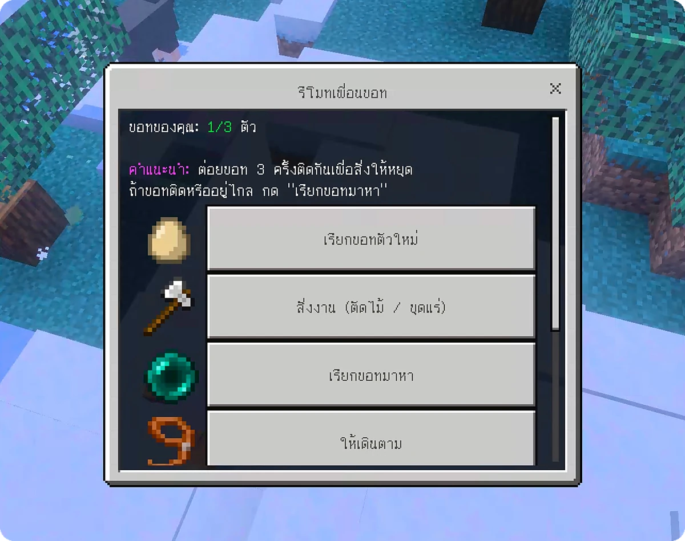

# Minecraft Natthawat AI Companion

Add-on สำหรับ Minecraft Bedrock ที่เพิ่ม "เพื่อนบอท" ซึ่งเดินตาม ช่วยสู้ ฮีลให้เมื่อเลือดน้อย และฝากของได้ ผู้เล่นสั่งงานบอทผ่านไอเทม **รีโมทเพื่อนบอท** ที่เปิดเมนูปุ่มได้ จึงไม่ต้องพิมพ์คำสั่ง

<p align="center">
  
  <br>
  <em>เมนูรีโมทเพื่อนบอทในเกม</em>
</p>

ต้องใช้ Minecraft Bedrock เวอร์ชัน 1.21.100 ขึ้นไป และไม่ต้องเปิด Experiments ใด ๆ เพราะใช้เฉพาะ Script API แบบ stable (`@minecraft/server` 2.1.0 และ `@minecraft/server-ui` 2.0.0)

## ที่มา

Add-on นี้ทำโดยพ่อของ Natthawat Seneewong Na Ayutthaya (ณัฐวรรธน์ เสนีวงศ์ ณ อยุธยา) เพื่อให้ลูกชายได้ใช้เล่น ใครอยากนำไปใช้ก็ใช้ได้เลย แต่อาจจะยังไม่ perfect เพราะตั้งใจทำให้ลูกชายเล่นเป็นหลัก

## สร้างไฟล์ติดตั้ง (บน Mac)

```bash
./build.sh
```

คำสั่งนี้สร้างรายการลายแมวด้วย `gen_skins.py` แล้วตรวจไฟล์ด้วย `check.py` ก่อน จากนั้นจึงสร้าง `dist/NatthawatAICompanion_<version>.mcaddon` (เช่น `NatthawatAICompanion_1_4_0.mcaddon` เลขเวอร์ชันมาจาก `Companion_BP/manifest.json`) ซึ่งเป็นไฟล์ zip ที่มีทั้ง Behavior Pack และ Resource Pack ไม่ต้องติดตั้งเครื่องมือเพิ่ม เพราะใช้แค่ `zip`, `python3` และ `node` ที่มีในเครื่องอยู่แล้ว

## ติดตั้งบน Windows

1. ส่งไฟล์ `NatthawatAICompanion_<version>.mcaddon` ไปที่เครื่อง Windows แล้วดับเบิลคลิก เกมจะเปิดขึ้นมาและ import ทั้งสอง pack ให้เอง
2. สร้างโลกใหม่ หรือแก้ไขโลกเดิม แล้วไปที่ **Behavior Packs** เลือก **Natthawat AI Companion** และกด Activate (Resource Pack จะถูกเปิดตามให้อัตโนมัติ)
3. เข้าโลก ผู้เล่นจะได้รับ **รีโมทเพื่อนบอท** หนึ่งอันตอนเข้าโลกครั้งแรก

## อัปเดตเป็นเวอร์ชันใหม่

Minecraft ไม่อัปเดต add-on ที่ติดตั้งเองให้อัตโนมัติ มี 2 วิธีดังนี้

**วิธีที่ 1: ลบของเก่าแล้ว import ใหม่**
1. ในเกมไปที่ Settings > Storage แล้วลบ Natthawat AI Companion ทั้ง Behavior Pack และ Resource Pack
2. ดับเบิลคลิกไฟล์ `.mcaddon` ตัวใหม่
3. เปิดโลก ไปที่ Behavior Packs และ Resource Packs แล้วตรวจว่าทั้งสอง pack อยู่ในรายการ Active และเป็นเวอร์ชันใหม่ ถ้า Resource Pack ไม่อยู่ใน Active บอทจะล่องหน

**วิธีที่ 2: ใช้โฟลเดอร์ development (เหมาะกับการอัปเดตบ่อย)**

pack ในโฟลเดอร์ development ถูกโหลดใหม่ทุกครั้งที่เปิดโลก จึงไม่ต้อง import ซ้ำหรือเลื่อนเลขเวอร์ชัน บน Windows ที่ใช้ Minecraft 1.21.120 ขึ้นไป โฟลเดอร์อยู่ที่ `%AppData%\Minecraft Bedrock\Users\Shared\games\com.mojang\` (เวอร์ชันก่อนหน้านั้นอยู่ที่ `%LocalAppData%\Packages\Microsoft.MinecraftUWP_8wekyb3d8bbwe\LocalState\games\com.mojang\`)

1. ลบ pack ที่เคย import ไว้ใน Settings > Storage ก่อน เพื่อไม่ให้มี pack UUID เดียวกันสองชุด
2. คัดลอก `Companion_BP` ไปไว้ใน `development_behavior_packs\` และ `Companion_RP` ไปไว้ใน `development_resource_packs\`
3. เปิด pack ในโลกครั้งแรกครั้งเดียว ครั้งต่อไปแค่คัดลอกโฟลเดอร์ทับแล้วเปิดโลกใหม่

## วิธีเล่น

ถือรีโมทแล้วกดใช้ (คลิกขวา) จะมีเมนูดังนี้

| ปุ่ม | สิ่งที่เกิดขึ้น |
|---|---|
| เรียกบอทตัวใหม่ | บอทเกิดข้าง ๆ และเป็นของผู้เล่นทันที โดยแต่ละคนมีได้สูงสุด 3 ตัว |
| สั่งงาน (ตัดไม้ / ขุดแร่) | เปิดเมนูสั่งงาน (ดูหัวข้อถัดไป) |
| เรียกบอทมาหา | บอททุกตัวของผู้เล่นวาร์ปมาหา ใช้ตอนบอทติดหรืออยู่ไกล |
| ให้เดินตาม | บอทเดินตามในระยะ 2–4 บล็อก และวาร์ปมาหาเองเมื่อผู้เล่นวิ่งห่างเกิน 12 บล็อก |
| ให้รอตรงนี้ | บอทหยุดเดินตามและรออยู่ที่เดิม |
| หยุดสิ่งที่ทำอยู่ | บอทเลิกงานหรือเลิกสู้ และพักการโจมตี 10 วินาที แล้วกลับมาเดินตาม |
| ส่งบอทกลับบ้าน | ลบบอททุกตัวของผู้เล่น (มีหน้ายืนยันก่อน) และของที่ฝากไว้จะหล่นที่พื้น |

รีโมทเปิดเมนูเฉพาะการกดครั้งใหม่ คือต้องไม่มีการกดใช้รีโมทเข้ามาเลยอย่างน้อยครึ่งวินาทีก่อนหน้า นับจากการกดครั้งล่าสุดหรือจากตอนปิดเมนู เพราะถ้ากดค้าง หรือเกมยังคิดว่าปุ่มค้างอยู่หลังปิดเมนู เกมจะส่งการกดใช้เข้ามาซ้ำทุกไม่กี่ tick และเคยทำให้เมนูเด้งกลับมาเรื่อย ๆ (v1.4.0–v1.5.0)

### สั่งงาน

| ปุ่มในเมนูสั่งงาน | สิ่งที่เกิดขึ้น |
|---|---|
| ตัดต้นไม้ใกล้ ๆ 1 ต้น | บอทหาต้นไม้ที่ใกล้ผู้เล่นที่สุดในระยะ 16 บล็อก เดินไปที่ต้น แล้วฟันทีละท่อนจากล่างขึ้นบนจนหมดต้น ไม้ทุกท่อนจะไปตกที่ตัวผู้เล่น |
| ขุดแร่ใกล้ ๆ | บอทหาแร่ที่มองเห็นได้ (ติดกับอากาศ) ในระยะ 10 บล็อก เดินไปแล้วขุดทั้งสายแร่นั้น ไม่เกิน 16 ก้อน ของที่ได้จะไปตกที่ตัวผู้เล่น |
| ช่วยตามที่ฉันทำ: เปิด/ปิด | เมื่อเปิดไว้ ถ้าผู้เล่นตัดไม้หรือขุดแร่ก้อนแรกเอง บอทจะช่วยทำส่วนที่เหลือของต้นหรือสายแร่นั้น ปิดได้ทุกเมื่อ ค่าเริ่มต้นคือปิด |

กติกาที่กันไม่ให้บอทตัดไม้จนหมดป่าหรือรื้อบ้าน:

- บอททำงานครั้งละหนึ่งต้นหรือหนึ่งสายแร่ แล้วกลับมาเดินตาม ไม่ทำต่อเอง และทั้งโลกมีงานได้ครั้งละหนึ่งงาน
- บอทนับเฉพาะท่อนไม้ที่ติดกับใบไม้เป็นต้นไม้ บ้านหรือของที่สร้างจากท่อนไม้ซึ่งไม่มีใบติดอยู่จะไม่ถูกแตะ
- ต่อยบอท 3 ครั้ง หรือกด "หยุดสิ่งที่ทำอยู่" เพื่อหยุดกลางคัน

Script API แบบ stable ไม่มีคำสั่งให้ mob เดินไปยังตำแหน่งที่กำหนด บอทจึงเดินด้วยระบบหาทางของเกมเอง: script วาง entity ล่องหน (`bot:waypoint`) ไว้ที่ท่อนไม้หรือแร่ก้อนแรก แล้วให้บอทเล็งมันเหมือนเป้าหมายที่จะตี บอทจึงหาทางเดินไปเอง และเหวี่ยงแขนใส่ระหว่างตัด ถ้าเดินไปไม่ถึงภายใน 20 วินาที (เช่นต้นไม้อยู่บนหน้าผา) บอทจะยกเลิกงานและบอกผู้เล่น โดยไม่วาร์ปไปเอง ส่วนของที่ได้จากแร่คิดตามกฎของเกมแบบไม่มี enchant (เช่นแร่เหล็กได้เหล็กดิบ 1 ก้อน แร่ทองแดงได้ 2–5 ก้อน)

นอกจากเมนูแล้วยังมีวิธีอื่นอีกดังนี้

- **ต่อยบอท 3 ครั้งภายใน 3 วินาที** เท่ากับสั่ง "หยุด" ส่วนการต่อยครั้งเดียวไม่มีผลอะไร และผู้เล่นทำให้บอทเลือดลดไม่ได้
- **คลิกขวาที่บอท** เพื่อเปิดช่องฝากของ 27 ช่อง ซึ่งเปิดได้เฉพาะเจ้าของ
- **ป้อนแอปเปิ้ล คุกกี้ หรือขนมปัง** เพื่อฮีลบอท
- เมื่อผู้เล่นเลือดเหลือไม่เกิน 4 หัวใจและมีบอทอยู่ในระยะ 16 บล็อก บอทจะเติมเลือดให้ทันที 3 หัวใจ และใส่ Regeneration II อีก 5 วินาที แล้วพัก 20 วินาทีก่อนฮีลครั้งถัดไป

คำสั่งสำรองสำหรับพ่อแม่หรือตอนรีโมทหาย (พิมพ์ในแชต ไม่ต้องเปิด cheats):

| คำสั่ง | ใช้ทำอะไร |
|---|---|
| `/bot:remote` | รับรีโมทอันใหม่ |
| `/bot:summon` | เรียกบอทตัวใหม่ |
| `/bot:here` | เรียกบอททุกตัวมาหา |
| `/bot:follow` / `/bot:sit` / `/bot:stop` | เดินตาม / รอตรงนี้ / หยุด |
| `/bot:kill` | ลบบอททุกตัวของผู้เล่น |
| `/bot:chop` / `/bot:mine` | ตัดต้นไม้ใกล้ ๆ 1 ต้น / ขุดแร่ใกล้ ๆ |
| `/bot:helper` | เปิดหรือปิดโหมดช่วยตามที่ฉันทำ |
| `/bot:debug` | เปิดหรือปิดการแสดงเหตุการณ์ของรีโมทในแชต เช่นการกดที่เปิดเมนู การกดที่ถูกข้ามพร้อมเหตุผล และผลของแต่ละหน้าเมนู ใช้ตอนหาบั๊ก |

## หน้าตาของบอท

บอทเป็นแมวที่ใช้โมเดลและท่าทางของแมวในเกม โดยเดินเมื่อเคลื่อนที่และนั่งเมื่ออยู่นิ่ง แต่ละตัวสุ่มลายตอนเกิดจาก 11 ลายของเกม (tabby, ดำขาว, ส้ม, siamese, british shorthair, calico, persian, ragdoll, ขาว, jellie และดำล้วน)

เพิ่มลายเองได้ดังนี้

1. เตรียมไฟล์ PNG ขนาด 64x32 ที่ใช้รูปแบบเดียวกับ texture แมวของเกม
2. ตั้งชื่อไฟล์ด้วยตัวพิมพ์เล็ก ตัวเลข และ `_` เท่านั้น เช่น `rainbow.png`
3. วางไฟล์ไว้ที่ `Companion_RP/textures/entity/bot_skins/` แล้วรัน `./build.sh` ตัว build จะเพิ่มลายเข้ารายการสุ่มให้เอง และจะหยุดพร้อมบอกเหตุผลถ้าชื่อไฟล์หรือขนาดไม่ถูกต้อง

บอทจำลายด้วยลำดับในรายการ ดังนั้นการเพิ่มหรือลบไฟล์อาจทำให้บอทที่มีอยู่แล้วเปลี่ยนลาย ส่วนบอทตัวใหม่จะสุ่มจากรายการล่าสุดเสมอ

ไฟล์ `Companion_RP/entity/companion.entity.json` และ `Companion_RP/render_controllers/bot_companion.render_controllers.json` ถูกสร้างใหม่ทุกครั้งที่ build จึงไม่ควรแก้ด้วยมือ

ก่อนหน้านี้ (v1.1.0–v1.3.2) บอทใช้โมเดลผู้เล่นแบบ Steve/Alex แต่ในเกมจริงบอทล่องหนทั้งที่ Resource Pack ถูกโหลดอยู่ และยังหาสาเหตุไม่ได้ จึงเปลี่ยนมาใช้แมวแทน

## ข้อจำกัดที่รู้แล้ว

- บอทวาร์ปได้ 2 กรณีเท่านั้น คือผู้เล่นกด "เรียกบอทมาหา" หรือพิมพ์ `/bot:here` และตอนเดินตามแล้วผู้เล่นห่างเกิน 12 บล็อก การตัดไม้และการขุดแร่ใช้การเดินทั้งหมด
- script มองเห็นเฉพาะบอทที่อยู่ใน chunk ที่โหลดอยู่ ถ้าทิ้งบอทไว้ไกลมาก (เช่นสั่งรอไว้แล้วเดินไปไกล) ปุ่มเรียกมาหาและปุ่มส่งกลับบ้านจะหาบอทตัวนั้นไม่เจอ และบอทตัวนั้นไม่ถูกนับในโควตา 3 ตัว จนกว่าผู้เล่นจะกลับไปใกล้ ๆ
- ไม่มี spawn egg เพื่อให้โควตาต่อผู้เล่นใช้ได้จริง แต่ถ้าใช้ `/summon bot:companion` จะได้บอทป่าที่ต้องป้อนแอปเปิ้ลก่อนถึงจะเป็นของผู้เล่น และทั้งโลกมีบอทได้ไม่เกิน 10 ตัว
- บอทที่เรียกไว้ตั้งแต่เวอร์ชัน iron golem ไม่มีข้อมูลลาย จึงจะแสดงเป็นแมวลาย tabby ถ้าอยากให้สุ่มใหม่ให้ส่งบอทกลับบ้านแล้วเรียกตัวใหม่

## สถานะการทดสอบ

เวอร์ชันแรกที่ใช้โมเดล iron golem ทดสอบในเกมจริงแล้วว่าใช้งานได้ ส่วนเวอร์ชันที่เปลี่ยนเป็นโมเดลผู้เล่นยังตรวจแล้วเฉพาะบน Mac: JSON ทุกไฟล์อ่านได้, UUID ไม่ซ้ำ, ชื่อ event/group/texture อ้างถึงกันครบ, script ผ่าน `node --check` และทุก API ที่ script ใช้มีอยู่ใน type definition ของ `@minecraft/server` 2.1.0 กับ `@minecraft/server-ui` 2.0.0 ยังไม่ได้เปิดในเกมจริง จุดที่ต้องดูในเกมเป็นพิเศษมีดังนี้

1. บอทแสดงเป็นแมว เดินตอนเคลื่อนที่และนั่งตอนอยู่นิ่ง
2. ลายที่เพิ่มเองแสดงถูกต้อง
3. ปุ่มตัดไม้และขุดแร่ ซึ่ง logic ผ่านการรันกับโลกจำลองด้วย node แล้ว แต่ยังไม่ได้รันในเกม โดยเฉพาะว่าบอทเดินไปหา `bot:waypoint` ได้จริง
4. เมนูรีโมท (v1.5.1) กดครั้งเดียวแล้วเปิดเมนูครั้งเดียว ไม่เด้งกลับมาซ้ำ และหน้าสั่งงานกับหน้ายืนยันเปิดได้ในครั้งแรก ถ้ายังมีปัญหาให้พิมพ์ `/bot:debug` แล้วถ่ายรูปแชตตอนเกิดอาการ

## ถ้ามีปัญหา

**เมนูเด้งซ้ำหรือขึ้นเมนูหน้าตาต่างกันสลับกัน** แปลว่า add-on นี้ถูกโหลดมากกว่า 1 ชุดในโลกนั้น แต่ละชุดจะเปิดเมนูของตัวเองทุกครั้งที่กดรีโมท ตั้งแต่ v1.5.2 ตอนเข้าโลกจะมีข้อความ "พร้อมแล้ว (vX.Y.Z)" ในแชต และถ้าเจอชุดอื่นจะขึ้นคำเตือนสีแดง ส่วนท้ายเมนูรีโมทก็แสดงเลขเวอร์ชันของชุดที่เปิดเมนูนั้น

หาสำเนาทุกชุดบนเครื่อง Windows ได้ด้วย PowerShell คำสั่งนี้ ซึ่งค้นทั้งโฟลเดอร์ของ Minecraft เวอร์ชันใหม่ (GDK) และเวอร์ชันเก่า (UWP) รวมถึงสำเนาที่ฝังอยู่ในโฟลเดอร์ของโลก แล้วพิมพ์ตำแหน่งกับเวอร์ชันของ Behavior Pack แต่ละชุดออกมา

```powershell
$uuid = 'e9f2144e-2f7c-494f-ac52-d424e63b55d7'
Get-ChildItem "$env:APPDATA\Minecraft Bedrock", "$env:LOCALAPPDATA\Packages\Microsoft.MinecraftUWP_8wekyb3d8bbwe" -Recurse -Filter manifest.json -ErrorAction SilentlyContinue |
  ForEach-Object {
    try { $m = Get-Content $_.FullName -Raw | ConvertFrom-Json } catch { return }
    if ($m.header.uuid -eq $uuid) { '{0}   v{1}' -f $_.DirectoryName, ($m.header.version -join '.') }
  }
```

ถ้าเจอมากกว่า 1 บรรทัด ให้ปิด Minecraft ให้สนิทก่อน แล้วลบโฟลเดอร์ของชุดเก่าออก จากนั้นเปิดเกมใหม่

**ปัญหาอื่น ๆ** เปิด **Settings > Creator > Content Log GUI** ในเกม แล้วเข้าโลกใหม่ ข้อความ error ของ pack จะขึ้นที่มุมจอ ให้ถ่ายรูปหรือคัดลอกข้อความนั้นกลับมาเพื่อแก้ไข

## โครงไฟล์

```
Companion_BP/                 Behavior Pack
  manifest.json
  entities/companion.json     พฤติกรรมของบอท (เชื่อง, เดินตาม, สู้, ฝากของ, ทำงาน)
  entities/waypoint.json      หมุดล่องหนที่บอทเดินไปหาตอนทำงาน
  items/remote.json           ไอเทมรีโมท
  scripts/main.js             เมนู, คำสั่ง, โควตา, ฮีล, ต่อยเพื่อหยุด
  scripts/work.js             งานตัดต้นไม้, ขุดแร่ และโหมดช่วยตามที่ผู้เล่นทำ
Companion_RP/                 Resource Pack
  entity/companion.entity.json        สร้างโดย gen_skins.py
  render_controllers/                 สร้างโดย gen_skins.py
  textures/entity/bot_skins/          วางลายแมวเพิ่มเองที่นี่
  textures/items/bot_remote.png
  texts/en_US.lang
gen_skins.py                  สร้างรายการลายแมวสุ่ม
check.py                      ตรวจไฟล์ก่อน build
build.sh                      สร้าง dist/NatthawatAICompanion_<version>.mcaddon
```
